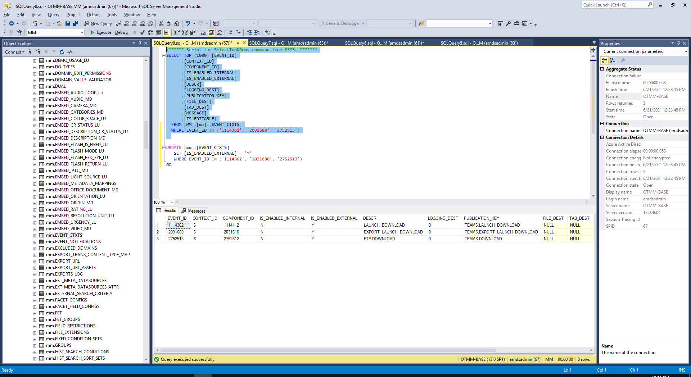

OpenText Media Management (OTMM) Event listener which listen the event **Ending import job (2229148)**.
This event is launched once the Rich Media Analysis (RMA) has finished.  

> NOTE: The data from Azure is deleted regardless of whether the extraction of media analytics succeeded or not.

Once the import job is finished the OCR text is available (only when the RMA has finished successfully).

This add-on search for Spanish plate number in the OCR text found in the image

> IMPORTANT: These add-on has been developed and tested on OTMM 21.3

If a plate number is found, It's stored in this custom fields: 

 * **CUSTOM.FIELD.CAR.PLATE.NUMBER**
 * **CUSTOM.FIELD.CAR.PLATE.COUNTRY** 
 * **CUSTOM.FIELD.CAR.BRAND**

> NOTE: These custom field must be created from TEAMS administration panel.

# Event handler registration
## Register event listener
1.	Copy this paragraph:

``` 
<!-- Custom event listener (Identify Spanish plates using OCR text from Rich Media Analysis) -->
<listener>
	<listener-class>com.opentext.otmm.sc.evenlistener.AnalysisDataFromAzureIsDeletedEventListenerRegistration</listener-class>
</listener>

<listener>
	<listener-class>com.opentext.otmm.sc.evenlistener.EndingImportJobEventListenerRegistration</listener-class>
</listener>

<listener>
	<listener-class>com.opentext.otmm.sc.evenlistener.MetadataUpdatedEventListenerRegistration</listener-class>
</listener>
```
 
2.	Open **web.xml** file located at **C:\Apps\MediaManagement\ear\artesia\otmmux\WEB-INF**
3.	Paste the paragraph under the **web-app** label

## log4j.xml

Log4j is a simple and flexible logging framework. The most common configuration options issuing  log4j.xml

Follow these steps:
1.	Copy these text:

``` 
<!-- Custom added by Joaquín: INIT -->
		
<logger name="com.opentext.otmm.sc.evenlistener">
	<level name="DEBUG"/>
	<appender-ref ref="console" />
	<appender-ref ref="file" />
</logger>
			
<logger name="com.opentext.otmm.sc.evenlistener.handler">
	<level name="DEBUG"/>
	<appender-ref ref="console" />
	<appender-ref ref="file" />
</logger>
			
<logger name="com.opentext.otmm.sc.evenlistener.helper">
	<level name="DEBUG"/>
	<appender-ref ref="console" />
	<appender-ref ref="file" />
</logger>
			
<logger name="com.opentext.otmm.sc.evenlistener.util">
	<level name="DEBUG"/>
	<appender-ref ref="console" />
	<appender-ref ref="file" />
</logger>

<logger name="com.opentext.otmm.sc.modules.plates">
	<level name="DEBUG"/>
	<appender-ref ref="console" />
	<appender-ref ref="file" />
</logger>

<!-- Custom added by Joaquín: END -->
``` 

2.	Paste the paragraph before the **&lt;/log4j:configuration&gt;** label into **C:\Apps\MediaManagement_TomEE\conf\log4j.xml**


## Deploy event listener classes
1.	Open **Services** Desktop App
2.	Select **Star OpenText MediaManagement Service**
3.	Right click on **Star OpenText MediaManagement Service**
4.	Select **Stop** in order to stop the service
5.	Copy the folder structure under the **&lt;PROJECT_HOME&gt;\bin**
6.	Paste the **com** folder under **C:\Apps\MediaManagement\ear\artesia\otmmux\WEB-INF\classes**
7.	Restart  **Star OpenText MediaManagement Service** from **Services** Desktop App


# SQL Server Management Studio

Follow these steps:
1.	Open SQL Server Management Studio
2.	Browse to OTMM-BASE (SQL Server - sa) > Databases > MM > Tables
3.	Select table mm.EVENT_CTXTS
4.	Edit row with `EVENT_ID = '2229148'` which corresponds with ‘Ending import job’ events
5.	Set IS_ENABLED_EXTERNAL = 'Y'



```sql 
USE [MM]
GO

SELECT [EVENT_ID]
      ,[CONTEXT_ID]
      ,[COMPONENT_ID]
      ,[IS_ENABLED_INTERNAL]
      ,[IS_ENABLED_EXTERNAL]
      ,[DESCR]
      ,[LOGGING_DEST]
      ,[PUBLICATION_KEY]
      ,[FILE_DEST]
      ,[TAB_DEST]
      ,[MESSAGE]
      ,[IS_EDITABLE]
  FROM [mm].[EVENT_CTXTS]
  WHERE EVENT_ID = '2229148'
GO
```

```sql 
UPDATE [mm].[EVENT_CTXTS]
   SET [IS_ENABLED_EXTERNAL] = 'Y'
   WHERE EVENT_ID = '2229148'
GO
```

# Generate project .jar file (in Eclipse)
1. Right click on Project folder
2. Click on **Export**
3. Select **JAR file**
4. Click on **Next**
5. Select only **src** folder at **Select the resource to export** list
6. Check **Select class files an resource**
7. Set **Select the export destination: JAR file**: **OTMMApplyWatermarkToLimitedUseAsset20.2.jar**
6. Click on **Finish**


# Required .jar files

> This section is only included to know the original location of the .jar files used in the project.

Import the indicated set of files to the indicated project folders:

**Set 1**
1. From: **C:\Apps\MediaManagement\jars**
 - artesia-server-tools.jar 
 - commons-io-2.8.jar 
 - commons-logging-1.2.jar
 - TEAMS-common.jar
 - TEAMS-mock-services.jar
 - TEAMS-sdk.jar
 - TEAMS-toolkit.jar
 
2. To project folder: **lib**

**Set 2**
1. From: **C:\Apps\MediaManagement_TomEE\lib**
 - servlet-api.jar
 
 2. To project folder: **lib**

**Set 3**
1. From: **C:\Apps\MediaManagement\deploy\commons**
 - commons-collections-3.2.2.jar 
 - commons-collections4-4.3.jar 
 - commons-fileupload-1.3.3.jar 
 - commons-lang-2.4.jar 
2. To project folder: **lib**

**Set 4**
1. From: **C:\Apps\MediaManagement\deploy\artesia**
 - otmm-rest-interfaces.jar
 - otmm-server-ext-api.jar
2. To project folder: **lib**


**Set 4**
1. From: **C:\Apps\MediaManagement\ear\artesia**
 - artesia-ejb.jar
2. To project folder: **lib**
